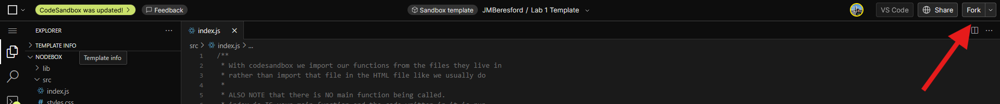
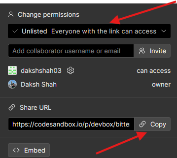

## Overview of the Labs
If this is your first lab, you will need to [create a CodeSandbox account](https://codesandbox.io/signin?continue=/dashboard) before starting the lab. You can sign in using any method you would like. 

Once you create your account, you are ready to start the lab.

## Starting The Lab
1. Open the CodeSandbox template link.

2. Before you work on the lab, **fork the template**.

   

3. Follow the lab document and work on your *fork* of the template.

4. Share the link to the lab clicking the share button in the top right. Change the permissions to either **unlisted** or **public**, and then click "copy".

   

5. Submit the copied link along with any group members you may have worked with as a textbox in canvas. 

{: .warning}
Once you have your link, check if it is accessibly by opening your link **in a private/incognito window**. If you can see your code, you're good to go. If you get any sort of error, go back to step 4 and change your link permissions. If you submit an inaccessible link, **we will dock points**. 

{: .warning}
There is no need to convert the sandbox into a devbox. This takes significantly longer for us to grade. 

{: .warning}
Submitting incorrect links will result in penalties to your lab grade. If you do submit an incorrect link but fix it after the lab deadline, then please make a **Piazza** post, do not email specific graders as they may not be in charge of that lab.