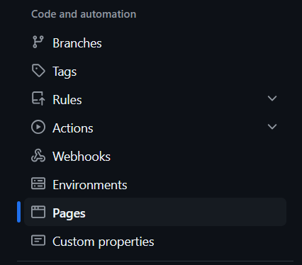

## Setting up Github Pages

{: .warning}
You're welcome to use another hosting solution for your assignments (e.g Vercel, self-hosting, etc.). However, if something goes wrong with your deployment, we won't be able to help. We highly recommend sticking with Github Pages.

{: .note}
Make sure your GitHub repository has already been set up. If not, see [Setting up your repository](githubrepo).

{: .warning}
Make sure your repository visibility is set to **public**, as deploying Github Pages from a private repository requires a premium subscription.

First, go to your repository settings. Under `Code and automation`, click `Pages`.



Under `Branch`, select `main`.


Leave the folder as `root` and click `Save`. Once you do so, your site should start to deploy. Once it has been deployed, you can access your site at `https://<your github username>.github.io/CSE-160/`. Whatever you see on this page is the contents of your `index.html`. 

When you submit your assignments, make sure you link the path to *that assignment's* HTML file. So for example, lets say your assignment 0 directory structure looked like this:

```
CSE-160
└── asgn0/
    └── src/
        ├── asgn0.js
        └── asgn0.html
```

Then the link would be `https://<your github username>.github.io/CSE-160/asgn0/src/asgn0.html`.

{: .warning}
Make sure you actually **check your Github Pages link before you submit**. In the past, some students have blindly submitted a Github Pages link without double checking their site, thinking that it must work on their webpage because it worked locally. You **will** lose points if your site does not work.