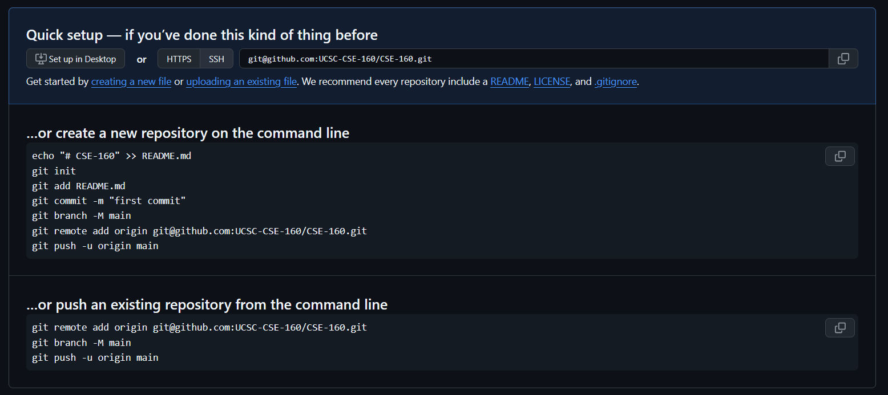
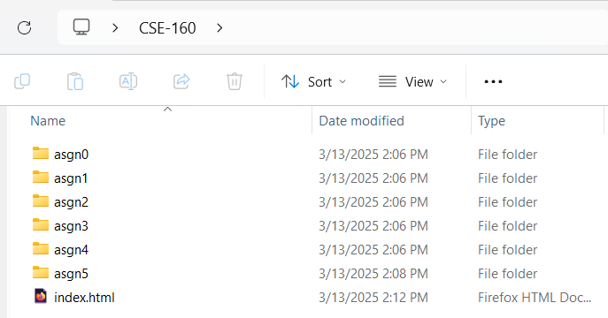

{:.toc}

## Setting up your Github Repository

{: .note}
This guide will show you how to create one repository where you put all of your assignments. In the past, some students prefered to create one repository per assignment, but this led to issues where some students forgot to deploy a page for that repo, had trouble submitting the right link, etc. By having one repository with all your assignments, you only have to deploy to Github Pages once, and the structure of your links will remain the same for all assignments.

First, log into your Github account and create a new empty repository called `CSE-160` or something like that. Make sure the repository's visibility is set to **public**, as deploying Github Pages from a private repository requires a premium subscription. Once you do, you should see something like this:



Copy the link in the Quick Setup box (it should look something like `git@github.com:<your GitHub username>/CSE-160.git`).

Now, anywhere locally on your machine, create the folder that you want to keep your CSE-160 assignments in. Then create 6 folders for assignments 0 through 5, as well as an `index.html`. Inside each of each assignment folder, create an empty README.md file. 



Later on, once we've deployed to Github Pages, the contents of `index.html` will be shown when you access `https://<your username>.github.io/CSE-160`. Feel free to put whatever you want there later, but for now, you can just put in a simple `Hello, CSE-160!`.

Once you've completed up till this point, your folder structure should look like this:

```
CSE-160
├── asgn0/
│   └── README.md
├── asgn1/
│   └── README.md
├── asgn2/
│   └── README.md
├── asgn3/
│   └── README.md
├── asgn4/
│   └── README.md
├── asgn5/
│   └── README.md
└── index.html
```

Now, we're gonna push this to our newly created repository. Open your terminal to your local CSE-160 folder and run the following commands:

```
git init
git add .
git commit -m "Initial commit"
git branch -M main
git remote add origin [the git@github.com thing you copied from github earlier]
git push -u origin main
```

Now that you've set up your repository, check out [Setting up GitHub Pages](githubpages) for instructions on how to set up your live hosted submission.