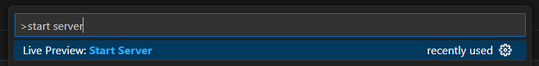
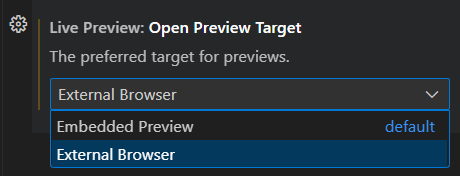

{: .no_toc}

## Local Setup

TODO: expand this 

To get started, install the Visual Studio Code [Live Preview](https://marketplace.visualstudio.com/items?itemName=ms-vscode.live-server) extension. 

Once you have the extension installed, you can start up a webserver by hitting <kbd>Ctrl</kbd> + <kbd>Shift</kbd> + <kbd>P</kbd> (or <kbd>⌘</kbd> + <kbd>Shift</kbd> + <kbd>P</kbd> on MacOS) to open the command pallete. Search for `Live Preview: Start Server` and select it.

This should open a new tab within VS Code that looks something like this:

[insert image here of the preview pane (what should be displayed here? should it be index.html?)]

This extension is quite convenient, as every time you make a change to a local file, the page will automatically refresh. However, we're gonna modify the extension settings to show the preview in your normal browser instead because it provides easy access to the web console, which you will need to use quite often for debugging your assignments. To do this, go to the VS Code extensions pane, search for `Live Preview` and click the settings cog.

[insert image here of that].

Scroll down until you see a setting called **Open Preview Target** and switch it to `External Browser`.

Now every time you start up your server, it should open in your default browser. (You may need to restart VS Code for this to work).

{: .note}
If it still doesn't work, you can just manually paste the IP address into your browser.

{: .warning}
# `localhost`/`127.0.0.1` ARE NOT LIVE HOSTED SUBMISSIONS. DO NOT TURN IN A `localhost` OR `127.0.0.1` LINK.