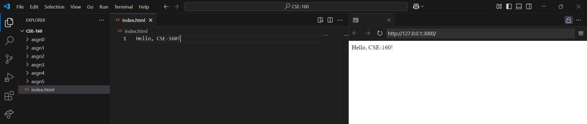
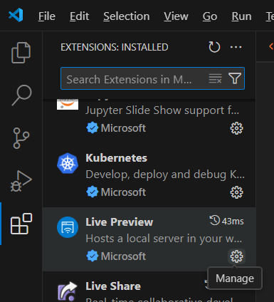
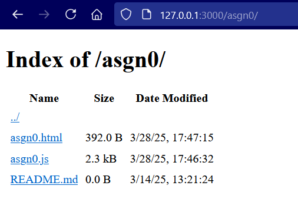

{: .no_toc}

## Local Setup

{: .note}
Make sure your GitHub repository has already been set up. If not, see [Setting up your repository](githubrepo).

To get started, install the Visual Studio Code [Live Preview](https://marketplace.visualstudio.com/items?itemName=ms-vscode.live-server) extension. Once you have the extension installed, you can start up a webserver by hitting <kbd>Ctrl</kbd> + <kbd>Shift</kbd> + <kbd>P</kbd> (or <kbd>⌘</kbd> + <kbd>Shift</kbd> + <kbd>P</kbd> on MacOS) to open the command pallete. Search for `Live Preview: Start Server` and hit enter.

This should open a new tab within VS Code that looks something like this:

This extension is quite convenient, as every time you make a change to a local file, the page will automatically refresh. However, we're gonna modify the extension settings to show the preview in your normal browser instead because it provides easy access to the web console, which you will need to use quite often for debugging your assignments. To do this, go to the VS Code extensions pane, search for `Live Preview` and click the settings cog.

Scroll down until you see a setting called **Open Preview Target** and switch it to `External Browser`.

Now every time you start up your server, it should open in your default browser. (You may need to restart VS Code for this to work).

{: .tip}
If you want it to instead open in a different browser than your default browser, find the setting called **Custom External Browser** and switch it to whichever browser you want. 

{: .note}
If it still doesn't work, you can just manually paste the IP address into your browser.

Whatever you see at the default link (usually `localhost:3000` or `127.0.0.1:3000`) is whatever you have in your `index.html`. If you go to `localhost:3000/asgn0`, you'll see the contents of your `asgn0` folder. 

You can use this file browser to navigate to your `asgn0.html` get a live preview of your code. 

{: .tip}
You can modify your index.html so that it links to each of your assignment HTML files directly. See [this gist](https://gist.github.com/iconsumeplutonium/6b2d84ef82371e3c631d9fee134055e7) for a sample index.html.

# `localhost`/`127.0.0.1` ARE NOT LIVE HOSTED SUBMISSIONS. DO NOT TURN IN A `localhost` OR `127.0.0.1` LINK. See [Setting up Github Pages](githubrepo) for instructions how to get a live hosted submission working if you have not done so already. 