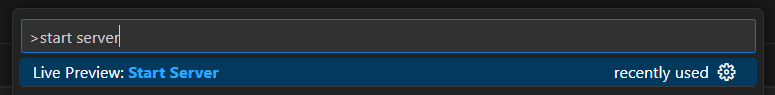

1. TOC
{:toc}

## Local Development

TODO: expand this 

To get started, install the Visual Studio Code [Live Preview](https://marketplace.visualstudio.com/items?itemName=ms-vscode.live-server) extension. 

Once you have the extension installed, you can start up a webserver by hitting `Control` + `Shift` + `P` (or `Command` + `Shift` + `P` on MacOS) and search for `Live Preview: Start Server` and hitting Enter.  

This should open a new tab within VS Code. 

# `localhost`/`127.0.0.1` ARE NOT LIVE HOSTED SUBMISSIONS. DO NOT TURN IN A `localhost` OR `127.0.0.1` LINK.
{: .no_toc}

